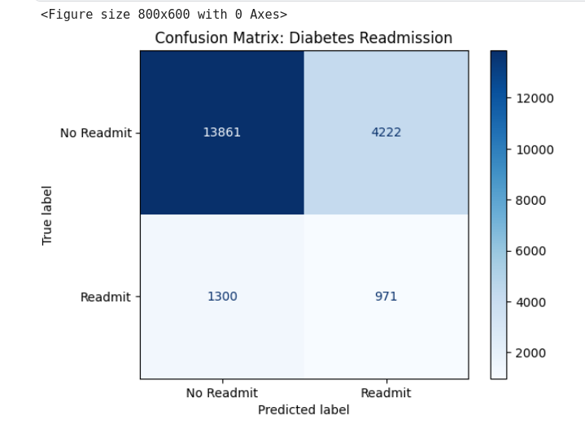

Markdown

# 🏥 Diabetes Readmission Prediction (XGBoost)


## 📌 Project Overview
This project implements a robust machine learning pipeline to predict **30-day hospital readmission** for diabetic patients. Using the **Diabetes 130-US Hospitals Dataset**, the model identifies high-risk patients who are likely to return to the hospital shortly after discharge.

Unlike many "toy" implementations that achieve unrealistic scores (AUC > 0.90) by using administrative leakage features, this project focuses on **clinical realism**. We explicitly removed post-discharge variables (e.g., `discharge_disposition_id`) to ensure the model relies only on information available *at the moment of decision-making*.

### 🎯 Key Objectives
* **Predict Readmission Risk:** Classify patients as `<30 days` (High Risk) vs. `>30 days` or `No Readmission`.
* **Prevent Data Leakage:** Rigorous feature engineering to remove administrative IDs that are not predictive but descriptive.
* **Handle Class Imbalance:** Utilize **SMOTE** and `scale_pos_weight` to address the severe imbalance between readmitted and non-readmitted patients.
* **Clinical Interpretability:** Map over 700+ ICD-9 diagnosis codes into meaningful clinical categories (e.g., *Circulatory*, *Respiratory*, *Diabetes*).

---

## 📊 Performance & Evaluation
Our model achieves a **ROC-AUC of 0.6473** on the held-out test set. While lower than "leaky" benchmarks, this score represents a robust, generalized ability to detect readmission risk based purely on clinical history and demographics.

### 1. ROC Curve
The model demonstrates a clear separation capability above the random baseline (Navy line).


### 2. Confusion Matrix & Clinical Impact
The confusion matrix reveals the trade-off between sensitivity and specificity:


* **True Positives (971):** High-risk patients correctly identified.
* **False Negatives (1300):** Missed readmissions (the primary target for future optimization).
* **Precision/Recall Trade-off:** The model prioritizes catching a broad net of at-risk patients while managing the high noise inherent in clinical data.

---

## 🛠️ Methodology

### Data Preprocessing (`src/preprocess.py`)
* **ICD-9 Grouping:** Raw diagnosis codes were grouped into 9 distinct clinical categories (Circulatory, Respiratory, Digestive, Diabetes, Injury, Musculoskeletal, Genitourinary, Neoplasms, Other) to reduce dimensionality.
* **Leakage Removal:** Dropped `encounter_id`, `patient_nbr`, and `discharge_disposition_id` to prevent the model from "cheating."
* **Encoding:** One-hot encoding for categorical variables (Race, Gender, A1C Results) and label encoding for age ranges.

### Modeling Strategy (`src/model.py`)
* **Algorithm:** **XGBoost Classifier** (`tree_method='hist'`).
* **Hyperparameters:**
    * `n_estimators=2000` (with Early Stopping)
    * `learning_rate=0.01` (Conservative updates for stability)
    * `max_depth=10` (Capturing complex interactions)
    * `scale_pos_weight`: Dynamic calculation based on training set imbalance.

---

## 📂 Repository Structure
This project follows a production-grade data science structure, separating experimental notebooks from modular source code.

```text
diabetes-readmission-prediction/
├── data/                   # (Excluded from Git) Raw CSV files
├── notebooks/              # Jupyter Notebooks for EDA and Experiments
│   ├── final_evaluation.py # Paired Jupytext script for version control
│   └── final_evaluation.ipynb # Visual notebook with plots
├── reports/                # Generated figures and metrics
│   ├── roc_curve.png
│   ├── confusion_matrix.png
│   └── risk_factors.png
├── src/                    # Source code for reproduction
│   ├── preprocess.py       # Data cleaning pipeline
│   ├── model.py            # Model architecture definition
│   ├── inference.py        # Script for predicting on new patients
│   └── diabetes_xgb_model.json # Trained model weights
├── requirements.txt        # Python dependencies
└── README.md           # Project documentation
```
---

## 🚀 Usage

### 1. Environment Setup
First, clone the repository and set up a clean Python environment (recommended):

```bash
# Clone the repo
git clone https://github.com/Musstavo/diabetes-readmission-prediction.git
cd diabetes-readmission-prediction

# Create a virtual environment (Linux/Mac)
python3 -m venv .venv
source .venv/bin/activate

# Install dependencies
pip install -r requirements.txt
```
### 2. ⚠️ Data Setup (Crucial)

The raw data is not included in this repo. You must download it manually:

1. Download the dataset from [Kaggle: Diabetes 130-US Hospitals](https://www.kaggle.com/datasets/brandao/diabetes).
2. Unzip the file.
3. Move `diabetic_data.csv` into the `data/` folder.
   
```bash
python src/inference.py data/diabetic_data.csv
```
### 3. Running Inference

To predict the readmission probability for a new batch of patients:
Ensure your data is in the correct format

## Reproducing the Experiments

The notebooks are managed via Jupytext. To run the full training pipeline:
```bash

# Sync the Python script to a Notebook format
jupytext --sync notebooks/final_evaluation.py

# Open in Jupyter or VS Code to run interactively
jupyter notebook notebooks/final_evaluation.ipynb
```
